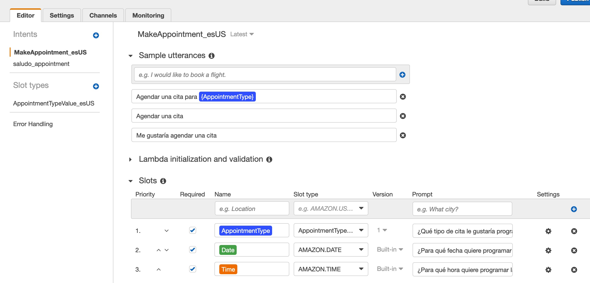
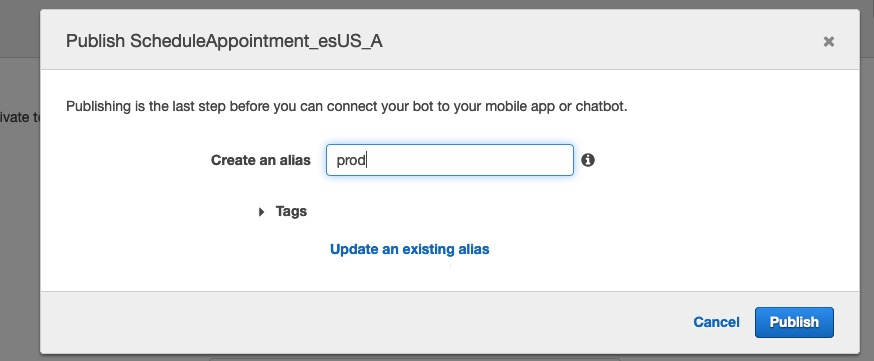
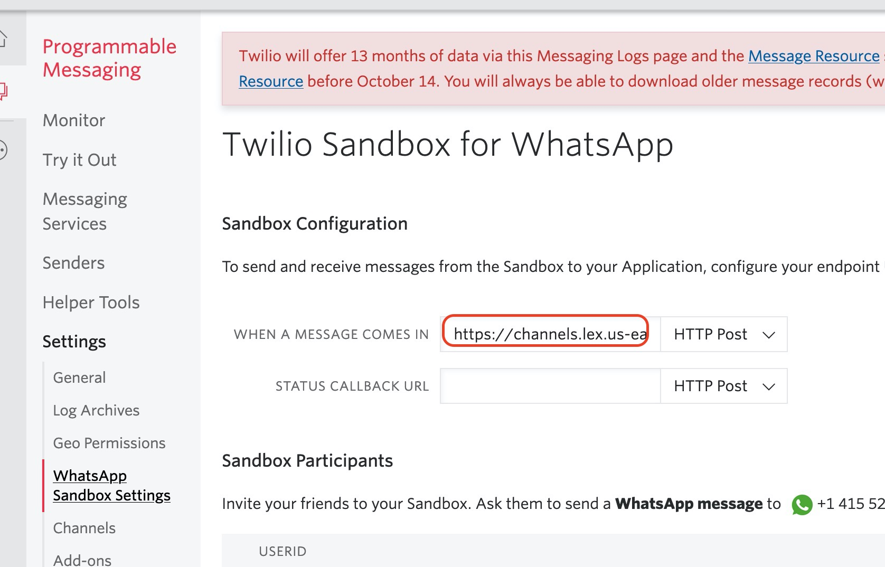
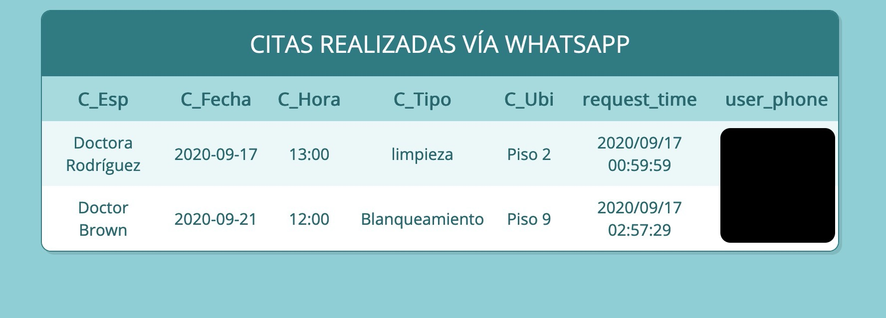

# Integraciónde Amazon Lex Bots con Whatsapp


---

# Instrucciones para despliegue

<br>
<br><br>

En este repositorio vamos a desplegar  una funcion lambda que recibe las solicitudes de agendas de un bot de Amazon Lex y las inserta en una base de datos.

Una aplicación real deberá validar lógicas de negocio por ejemplo: deberá validar que la agenda esté disponible o manejar también autorizaciones de pacientes validando el número telefónico por ejemplo. 

Además vamos a generar una cuenta Twilio y un Bot de Amazon Lex para recibir las solicitudes de agendamiento de clientes mediante Whatsapp.
___
<br>

# Paso 1: Backend de Agendamiento
---
<br>

```zsh 
git clone https://github.com/ensamblador/whatsapp-lex.git

```
Crear y activar un ambiente python virtual
(requiere virtualenv instalado)

```
cd whatsapp-lex
virtualenv -p python3 .env
source .env/bin/activate
```
Instalar los modulos de python necesarios
```
pip install -r requirements.txt
```
ver listado de aplicaciones (requiere cdk instalado https://docs.aws.amazon.com/cdk/latest/guide/cli.html )
```
cdk ls
```
*Nota: si no ha ejecutado CDK debará generar un boostrap con el comando `cdk bootstrap`*

desplegar la aplicacion backend (servicio de agendamiento Lambda-DynamoDB)

```
cdk deploy
```

use `cdk deploy --profile <profile-name>` en caso de que quiera desplegar con credenciales distintas al profile por defecto.

Limpiar eliminando la aplicacion 

```
cdk destroy
```

*Useful CDK commands*

 * `cdk ls`          list all stacks in the app
 * `cdk synth`       emits the synthesized CloudFormation template
 * `cdk deploy`      deploy this stack to your default AWS account/region
 * `cdk diff`        compare deployed stack with current state
 * `cdk docs`        open CDK documentation


___
<br><br><br>

#  Paso 2: Sandbox de Whatsapp Twilio
---
<br>
Genere una cuenta de twilio gratuita para acceder al Sandbox de Whatsapp 
https://www.youtube.com/watch?v=O2PB6o2E8aA

Una vez activado el sandbox deberá enrolar usuarios enviando un mensaje personalizado a el número de whatsapp provisto por twilio.


https://www.twilio.com/console/sms/whatsapp/sandbox

En este punto copie las __ACCOUNT SID__ y __AUTH TOKEN__ para ser utilizados en Amazon Lex.


https://www.twilio.com/console

<br><br><br>

#  Paso 3: Amazon Lex y Bot de Agendamiento 
---
<br><br>
En este paso combinamos todo, primero partimos accediendo al bot de agendamiento generado en el despliegue, (aunque puede ser el bot template o uno personal). No entraremos en detalles de como hacer un bot, dejamos una guía de como implementarlo en la consola de amazon lex https://docs.aws.amazon.com/es_es/lex/latest/dg/gs-bp-create-bot.html

Accedemos a la consola lex: https://console.aws.amazon.com/lex/home

Para el caso, el bot deberá ser capaz de recopilar la información del usuario para la agenda:

* ​AppointmentType : Tipo de agenda de consulta médica.
* Date: Fecha de agenda de consulta médica
* Time: Horario de agenda de consulta médica




Cuando accedamos al bot deberá estar en proceso de finalización de "Build", una vez que termine, veremos este mensaje:


y luego estará listo para publicar una versión:




Observamos que en el caso de la completitud de la intención ya está configurada la función lambda que responderá el resultado del agendamiento.


<br><br><br>
#  Paso 4 : Integrar con Twilio
---
<br><br>

Una vez publicdo el bot, en la pestaña channels -> Twilio SMS configuramos un nuevo canal utilizando Account SID y Auth Token de Twilio:


Esto nos generará un endpoint Url que vamos a copiar


Y lo pegamos en la url a llamar cuando llegue un mensaje:




Guardamos en twilio y ya está listo ahora probemos.

<br><br><br>
# Pruebas
---
<br>

Para probar el bot de agendamiento agregamos como contacto el número asignado por twilio y enviamos el mensaje de Opt-in, una vez enrolado ya estamos listos para utilizar:


Adicionalmente como parte del despliegue podemos acceder a la url que muestra las agendas realizads por whatsapp. 


Esta página se actualiza cada 10s y nos muestra las citas agendadas por Whatsapp.




Enjoy!

<br><br><br>
## Limpieza
---
Para eliminar los recursos generados basta con ejecutar en la carpeta del proyecto (cli)

```
cdk destroy
```

Fin.