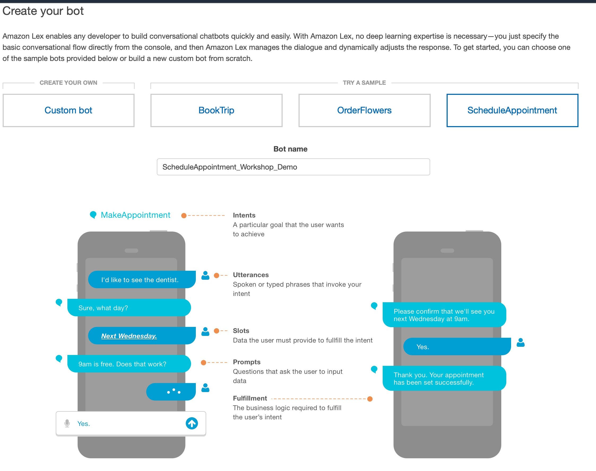
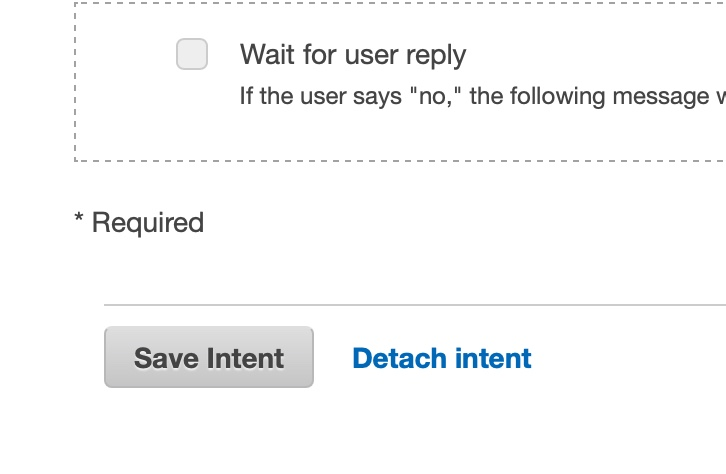
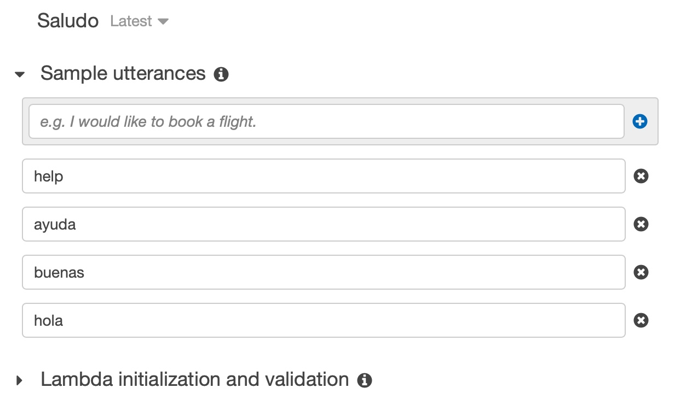

# Amazon Lex Chatbot

Amazon Lex es un servicio para crear interfaces de conversación con voz y texto. Ofrece las funcionalidades de deep learning como reconocimiento automático de voz para convertir voz en texto y tecnología de comprensión del lenguaje natural para reconocer la intención del texto. [Más información de Lex](https://aws.amazon.com/es/lex/)

Para crear un nuevo Chatbot vamos a la Consola de Lex en AWS (https://console.aws.amazon.com/lex).

Si no ve la consola de Amazon Lex, cambie a una las regiones soportadas 
https://docs.aws.amazon.com/general/latest/gr/lex.html 

* Si es la primera vez que utiliza Lex en esta región haga click en **Get Started**.
* Si ya cuenta con un bot, haga click en **Create** en el menú **Bots**

Para el proyecto utilizaremos el template de Schedule Appointment. En **Bot Name** utilizamos un nombre a elección. 

* Para **Language** elegimos Spanish (US) 
* **Sentiment analysis** No
* **COPPA** No

Una vez configurado hacemos click en **Create** 

Nuestro Bot Base está listo. 
___
# Intents, Utterances y Slots.

Una vez que nuestro Bot está creado accedemos a él. Podemos ver en editor los **Intents** (Intenciones) es decir,  los distintos objetivos que puede buscar un usuario cuando contacta al bot (agendar, consultar agenda, cancelar agenda).

Los **Slot Types** son variables customizadas asociadas a la intención (por ejemplo en este caso Tipo de Consulta). Es una información provista por el usuario. El bot llena estos slots en las conversaciones. Nota: los Slots que aparecen acá son sólo los de tipo "custom slots". Amazon Lex provee **Slots** ya construidos como Fecha, Hora, Lugares. Un listado completo lo encuentra acá https://docs.aws.amazon.com/lex/latest/dg/howitworks-builtins-slots.html  

**Utterances** son las conversaciones que pueden activar la intención. Estas frases ya podrían incorporar slots dentro del mensaje que envía el usuario.

**Intent Slots** los slots que debe llenar el Bot para la completar la Intención. Pueden ser custom o Nativos. El prompt es la frase con la que el bot consulta el el valor del slot (_Para cuando quiere agendar?_ debería responder el slot _Date_).

Vemos que el template nos muestra un Intent por defecto llamado `MakeAppointment_esUS` vamos a editarlo (click en el botón edit al lado del nombre) y realizamos los siguientes cambios.

1. **En fulfillment indicamos que responda los parámetros al cliente.**

   
1. **En `Sample Utterances` agregaremos un par de frases que incluyan otros slots**
De esta forma permitimos que en un solo mensaje podamos capturar las tres variables (los slots se definen en la frase usando paréntesis `{}`)

   

1. **En el Slot de de `AppointmentType`vamos a agregar un hint para que el usuario conozca las opciones de Citas**

Agregamos en el prompt "(Tratamiento de condicto, Control, Limpieza)"

   
1. **Después de hacer estas modificaciones Guardamos nuestro Intent.**

   
1. **Creamos Otro Intent que nos salude ante cualquier mensaje diferente y oriente al usuario**
* En `Intents` le damos al signo (+) y luego `Create Intent`

   
* Le damos un nombre y lo agregamos al bot.

   
* Para que este intent se active vamos a configurar las siguientes frases en `Utterances`

   
* Luego agregamos la respuesta que va a orientar a nuestro usuario a agendar.

    **_Hola. Yo te ayudaré a agendar una hora disponible de Dentista si me dices: "agendar una cita"_**

    

* Finalmente guardamos el nuevo intent y le damos al boton **Build**

Listo! nuestro bot ya puede saludar y ahora vamos a probarlo en la consola.

___
# Pruebas de Bot

Una vez que el bot está armado podemos acceder a la consola de pruebas, al lado derecho. Haga unas pruebas a ver si está respondiendo bien, en caso contrario revise los pasos anteriores nuevamente.

Cuando el Estado es `ReadyForFulFullment` significa que todos los Slots están completos y podemos proceder al agendamiento (no hemos llegado a eso aún 😎)

  

### **[Volver al proyecto ↩️ ](README_Step_by_Step.md)**